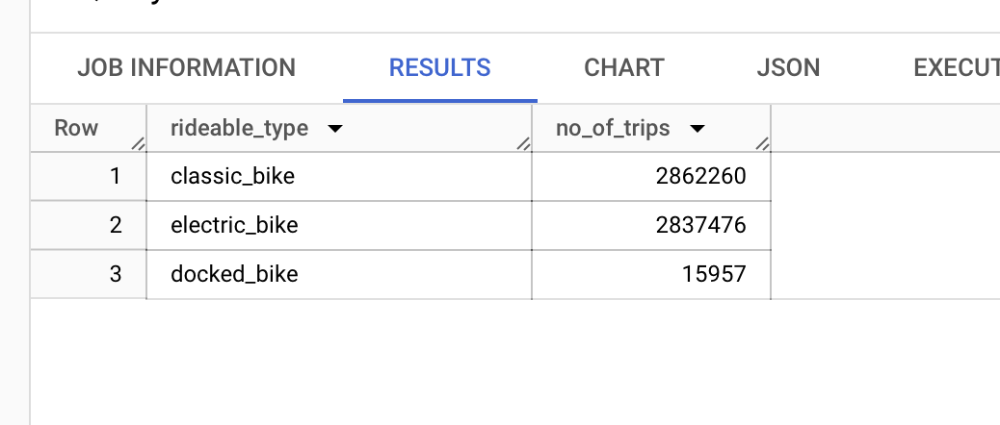
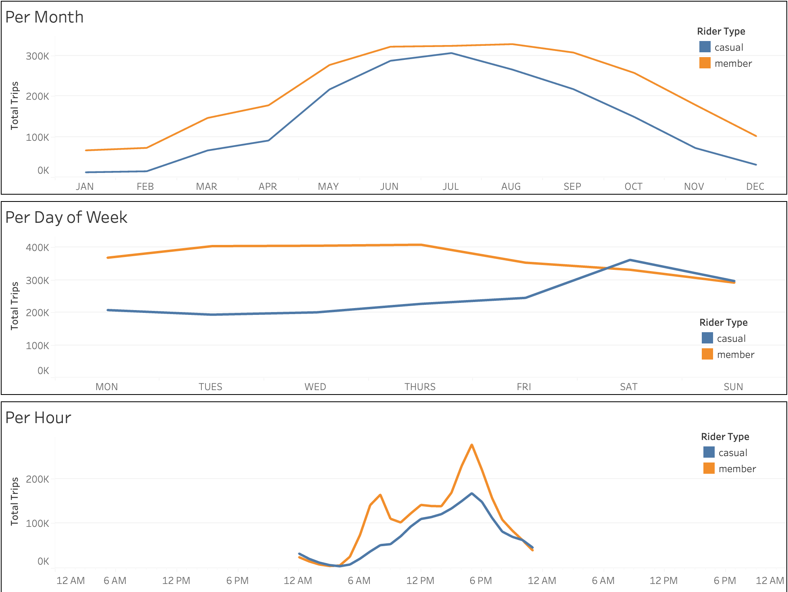

# Google-Data-Analytics-Capstone-Case-Study

## Introduction
In this case study, I am taking on the role of a junior data analyst at Cyclistic, a fictional bike-share company. My objective is to conduct data analysis to answer critical business questions. The analysis will follow the six steps of the data analysis process: [Ask](https://github.com/vedantwalia/Google-Data-Analytics-Capstone-Case-Study/blob/main/README.md#ask), [Prepare](https://github.com/vedantwalia/Google-Data-Analytics-Capstone-Case-Study/blob/main/README.md#prepare), [Process](https://github.com/vedantwalia/Google-Data-Analytics-Capstone-Case-Study/blob/main/README.md#process), [Analyze](https://github.com/vedantwalia/Google-Data-Analytics-Capstone-Case-Study/blob/main/README.md#analyze-and-share), [Share](https://github.com/vedantwalia/Google-Data-Analytics-Capstone-Case-Study/blob/main/README.md#analyze-and-share), and [Act](https://github.com/vedantwalia/Google-Data-Analytics-Capstone-Case-Study#act).

### Quick Links
- **Data Source:** [divvy_tripdata](https://divvy-tripdata.s3.amazonaws.com/index.html)  
- **SQL Queries:**  
  - [01. Data Combining](https://github.com/vedantwalia/Google-Data-Analytics-Capstone-Case-Study/blob/main/DataCombining.sql)  
  - [02. Data Observations](https://github.com/vedantwalia/Google-Data-Analytics-Capstone-Case-Study/blob/main/DataObservations.sql)  
  - [03. Data Cleaning](https://github.com/vedantwalia/Google-Data-Analytics-Capstone-Case-Study/blob/main/DataCleaning.sql)  
  - [04. Data Analysis](https://github.com/vedantwalia/Google-Data-Analytics-Capstone-Case-Study/blob/main/DataAnalysis.sql)  

- **Data Visualizations:** [Tableau Dashboard](https://public.tableau.com/views/GoogleDataAnalyticsCapstone_17239832032770/TripStartingLocationMap?:language=en-US&:sid=&:redirect=auth&:display_count=n&:origin=viz_share_link)

## Background

### Cyclistic
Cyclistic is a Chicago-based bike-share program offering over 5,800 bicycles and 600 docking stations. The company distinguishes itself by providing not only traditional bikes but also assistive options like reclining bikes, hand tricycles, and cargo bikes, making the service accessible to a wide range of users. While most users prefer traditional bikes, approximately 8% opt for the assistive options. The majority of Cyclistic riders use bikes for leisure, though around 30% use them for commuting.

Cyclistic's marketing strategy has traditionally targeted broad consumer segments with flexible pricing plans, including single-ride passes, full-day passes, and annual memberships. Customers who opt for single-ride or full-day passes are classified as casual riders, while those who purchase annual memberships are considered members.

Cyclistic's financial analysts have observed that annual members are significantly more profitable than casual riders. Based on this insight, the company's marketing director, Moreno, believes that the key to future growth lies in converting casual riders into annual members. She sees an opportunity to focus on marketing to these existing customers, who are already familiar with Cyclistic's offerings.

### Scenario
As a junior data analyst at Cyclistic, my role is to support the marketing team by analyzing the differences in bike usage between annual members and casual riders. This analysis will help in developing strategies to convert casual riders into annual members. Before making any recommendations, I will thoroughly analyze the data and present insights to Cyclistic executives.

## Ask

### Business Task
The primary business task is to create marketing strategies aimed at converting casual riders into annual members.

### Key Questions
To address this, the analysis will focus on three key questions:
1. How do annual members and casual riders differ in their use of Cyclistic bikes?
2. What factors might influence casual riders to purchase annual memberships?
3. How can digital media be leveraged to encourage casual riders to become members?

I have been tasked with answering the first question: *How do annual members and casual riders differ in their use of Cyclistic bikes?*

## Prepare

### Data Source
The analysis will utilize Cyclistic’s historical bike trip data from January 2022 to December 2022. This data, accessible via [divvy_tripdata](https://divvy-tripdata.s3.amazonaws.com/index.html), is provided by Motivate International Inc. under a [data license agreement](https://www.divvybikes.com/data-license-agreement).

The dataset contains details such as ride ID, bike type, start and end times, station names, locations, and whether the rider is a member or casual user. Due to data privacy regulations, personally identifiable information is not included, so individual trips cannot be linked to specific users.

### Data Organization
The data is divided into 12 monthly files for the year 2022. Each file contains columns like ride_id, rideable_type, started_at, ended_at, start_station_name, start_station_id, end_station_name, end_station_id, start_lat, start_lng, end_lat, end_lng, and member_casual.

## Process

### Data Platform
Given the large volume of data—over 5.6 million rows—BigQuery was chosen for data processing. BigQuery is capable of efficiently handling large datasets, unlike Microsoft Excel, which is limited to 1,048,576 rows per worksheet.

### Combining the Data
The 12 monthly CSV files were first uploaded as individual tables in BigQuery. These tables were then combined into a single table named "combined_data," which includes all 5,667,717 rows of data for 2022.

### Data Exploration
Before cleaning the data, an initial exploration was conducted to identify inconsistencies and gain a better understanding of the dataset.

**Key Observations:**
1. The dataset consists of various columns with different data types. The `ride_id` column serves as the primary key.
  
   

2. There are missing values in certain columns, particularly those related to station names and IDs, as well as end latitude and end longitude. These missing values are often found in the same rows.
   
   

3. 211 duplicate rows were detected in the dataset based on `ride_id`.
  
   

4. The `ride_id` values consistently contain 16 characters, so no cleaning is needed for this column.

5. The dataset includes three types of bikes: classic bikes, electric bikes, and docked bikes.
  
   

6. The `started_at` and `ended_at` columns record the start and end times of trips in the format `YYYY-MM-DD hh:mm:ss UTC`. A new column will be created to calculate ride length (trip duration), and additional columns for the day of the week and the month will be added to analyze usage patterns over time. Trips with implausible durations (e.g. shorter than a minute or in negative time) will be removed.

7. Many rows have missing values which will be removed, 4178598 rows are kept and 1537095 eliminated.

9. The `member_casual` column has two unique values: "member" and "casual," indicating whether the rider is a member or a casual user.

### Data Cleaning
The data cleaning process involved the following steps:

1. Removing rows with missing values.
2. Adding three new columns: `ride_length` (trip duration), `day_of_week`, and `month`.
3. Excluding trips with durations less than a minute or longer than a day.
4. A total of 1537095 rows were removed during the cleaning process.

## Analyze and Share

With the data now properly organized, I conducted queries across multiple relevant tables and visualized the results in [Tableau](https://public.tableau.com/views/GoogleDataAnalyticsCapstone_17239832032770/TripStartingLocationMap?:language=en-US&:sid=&:redirect=auth&:display_count=n&:origin=viz_share_link) to address the key analysis question: *How do annual members and casual riders differ in their usage of Cyclistic bikes?*

### Bike Usage by Type
First, I compared the types of bikes used by members versus casual riders.

Members account for 64.83% of the total usage, with casual riders making up the remaining 35.17%. The most popular bike type is the classic bike, followed by electric bikes, with docked bikes being the least used, exclusively by casual riders.

### Trip Distribution by Time
Next, I analyzed the distribution of trips by month, day of the week, and hour of the day.

- **Months:** Both members and casual riders show similar seasonal patterns, with higher trip numbers in the spring and summer and a decline towards omnset of winter. The gap between casual riders and members narrows in July.
  
- **Days of the Week:** Casual riders tend to take more trips on weekends, while members show a dip in weekend usage compared to weekdays.
  
- **Hours of the Day:** Members display two peak usage times—one in the morning (around 6-8 am) and another in the evening (around 4-8 pm)—which aligns with commuting hours. Casual riders, on the other hand, steadily increase their usage throughout the day, peaking in the evening.

These patterns suggest that members primarily use bikes for weekday commuting, while casual riders likely use them for leisure activities, especially on weekends and during the warmer months.

### Trip Duration Comparison
I then compared the ride durations between members and casual riders.

  

Casual riders tend to take longer trips on average compared to members. While members' trip durations remain consistent throughout the year, week, and day, casual riders' trip lengths vary—being longer in spring and summer, on weekends, and during the day between 10 am and 2 pm. Their shortest trips occur between 5 and 8 am.

These observations indicate that casual riders, though less frequent users, tend to take longer trips, especially on weekends and during the day, likely for recreational purposes.

### Station Location Analysis
Finally, I examined the starting and ending locations of trips to further differentiate between casual and member riders.

  

Casual riders frequently start their trips near museums, parks, beaches, harbor points, and aquariums. In contrast, members tend to start their journeys from stations near universities, residential areas, restaurants, hospitals, grocery stores, theaters, schools, banks, factories, train stations, parks, and plazas.

A similar pattern is observed in ending station locations: casual riders often finish their trips near recreational sites, while members end their rides near educational, residential, and commercial areas. This reinforces the idea that casual riders use bikes for leisure, whereas members rely on them for daily commutes.

### Summary

| **Casual Riders** | **Members** |
|------------------|-------------|
| Prefer riding throughout the day, with more trips on weekends in spring and summer for leisure activities. | Prefer riding on weekdays during commuting hours (8 am and 5 pm) in spring and summer. |
| Take longer trips (about twice as long) but ride less frequently than members. | Ride more frequently but take shorter trips (roughly half the duration of casual riders' trips). |
| Start and end their trips near parks, museums, and other recreational sites. | Start and end their trips near universities, residential, and commercial areas. |

## Act
Having identified the differences between casual and member riders, I propose the following marketing strategies to convert casual riders into members:

1. Launch targeted marketing campaigns in spring and summer at popular tourist and recreational locations frequented by casual riders.
2. Offer seasonal or weekend-specific membership plans, as casual riders are most active during these times.
3. Introduce discounts for longer rides to appeal to casual riders and potentially encourage members to take longer trips.